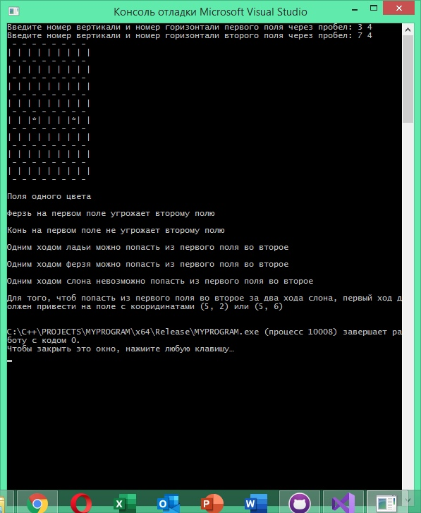

# Описание работы программы
Программа запрашивает координаты первого поля через пробел, затем координаты второго. Программа нарисует шахматную доску и отмеченные поля, затем последовательно совершает проверки и выводит информацию
# Скриншот работы программы 

